# 魔搭社区和LLM大模型基础知识

**魔搭LLM大模型开源生态图**

近一年来，大语言模型（LLM）成为为全球科技与社会关注的焦点，公众对这类模型所蕴含的先进技术及其广泛应用有了更为深入的认知。关于LLMs是否应采取开源策略的话题引发了广泛的热议和深度探讨。魔搭ModelScope社区在过去的一年中，积极推动开源模型的发展，魔搭社区通过开源推动模型贡献者的研究成果的透明度提升和可复制性的强化，同时激发中国研究者和开发者社群的集体创新潜能。

LLM专题页：

[https://modelscope.cn/topic/dfefe5be778b49fba8c44646023b57ba/pub/summary](https://modelscope.cn/topic/dfefe5be778b49fba8c44646023b57ba/pub/summary)

## 基础模型研究：

2023年，随着LLM技术的发展，中国模型研究机构的开源模型迎来了爆发式的增长：

2023年3月，智谱AI首先在魔搭社区发布了ChatGLM-6B系列，ChatGLM-6B 是一个开源的、支持中英双语问答的对话语言模型，基于 General Language Model (GLM) 架构，具有 62 亿参数。结合模型量化技术，用户可以在消费级的显卡上进行本地部署（INT4 量化级别下最低只需 6GB 显存）。现在，智谱AI的ChatGLM-6B已经更新到第三代，同时在多模态推出了CogVLM系列，以及支持视觉agent的CogVLM，在代码领域推出了CodeGeex系列模型，同时在agent和math均有探索和开源的模型和技术。

2023年6月，百川首先在魔搭社区发布了百川-7B模型，baichuan-7B是由百川智能开发的一个开源的大规模预训练模型。基于Transformer结构，在大约1.2万亿tokens上训练的70亿参数模型，支持中英双语，上下文窗口长度为4096。百川也是较早推出预训练模型的公司，并戏称给开发者提供更好的“毛坯房”，让开发者更好的“装修”，推动了国内基于预训练base模型的发展。后续百川发布了13B模型，以及百川2系列模型，同步开源base和chat两个版本。

2023年7月，上海人工智能实验室在WAIC 2023开幕式和科学前沿全体会议上，联合多家机构发布全新升级的“书生通用大模型体系”，包括书生·多模态、书生·浦语和书生·天际等三大基础模型，以及首个面向大模型研发与应用的全链条开源体系。上海人工智能实验室不仅做了模型weights的开源，还在模型、数据、工具和评测等层面进行全方位开源，推动技术创新与产业进步。后续上海人工智能实验室陆续发布了书生·浦语20B模型，以及书生·灵笔多模态模型。

2023年8月，阿里巴巴开源了通义千问7B模型，后续相继开源了1.8B，14B，72B的base和chat模型，并提供了对应的int4和int8的量化版本，在多模态场景，千问也开源了qwen-vl和qwen-audio两种视觉和语音的多模态模型，做到了“全尺寸、全模态”开源，Qwen-72B提升了开源大模型的尺寸和性能，自发布以来一直维持在各大榜单榜首，填补了国内空白。基于Qwen-72B，大中型企业可开发商业应用，高校、科研院所可开展AI for Science等科研工作。

2023年10月，昆仑万维发布百亿级大语言模型「天工」Skywork-13B系列，并罕见地配套开源了600GB、150B Tokens的超大高质量开源中文数据集。**Skypile/Chinese-Web-Text-150B**数据集。由昆仑经过精心过滤的数据处理流程从中文网页中筛选出的高质量数据。**大小约为600GB，总token数量约为（1500亿），是目前最大得开源中文数据集之一。**

**2023年11月，**01-AI 公司发布了 Yi 系列模型，其参数规模介于 60 亿至 340 亿之间，训练数据量达到了 300 亿token。这些模型在公开排行榜（如 Open LLM leaderboard）以及一些极具挑战性的基准测试（例如 Skill-Mix）中的表现，均超过了之前的模型。

## 模型定制新范式

性能卓越的模型和行业定制模型通常需要在预训练模型上，通过数据进过多次微调得来的。过去的一年中，来自社区的贡献者通过模型微调的方式，持续在各个方向做探索，并回馈社区，贡献了更加繁荣的行业模型生态。

idealab发布的姜子牙通用大模型是基于LLaMa的130亿参数的大规模预训练模型，具备翻译，编程，文本分类，信息抽取，摘要，文案生成，常识问答和数学计算等能力。

OpenBuddy致力于面向全球用户提供强大的多语言聊天模型，强调对话式AI对英语、中文和其他语言的无缝多语言支持。

Codefuse和wisdomshell专注于代码领域，希望提升开发者效率，让代码使用更加简单，在各类评测中，效果远超基准。

FinGLM和通义金融模型，专注在金融领域，基于GLM模型和千问模型，提供了金融年报解读，金融名词解释等金融行业垂直能力。

浙江大学，东北大学，大连理工，华东理工大学，南方科技大学，北京大学袁粒项目组，香港中文大学openmmlab等高校实验室通过微调预训练模型，推动开源模型在司法行业，教育行业，医疗行业，视频领域，全模态等方向发展。

魔搭预训练大模型合作生态

魔搭大模型微调部署生态

**LLM类型介绍**

## Base模型和Chat模型

我们通常会看到某模型研发机构开源了base模型和chat模型，那base模型和chat模型有什么区别呢？

首先，所有的大语言模型（LLM）的工作方式都是接收一些文本，然后预测最有可能出现在其后面的文本。

**base模型**，也就是基础模型，是在海量不同文本上训练出来的预测后续文本的模型。后续文本未必是对指令和对话的响应。

qwen-1.8B

qwen-1.8B-Chat

**chat模型**，也就是对话模型，是在base基础上通过对话记录（指令-响应）继续做微调和强化学习，让它接受指令和用户对话时，续写出来的是遵循指令的，人类预期的assistant的响应内容。

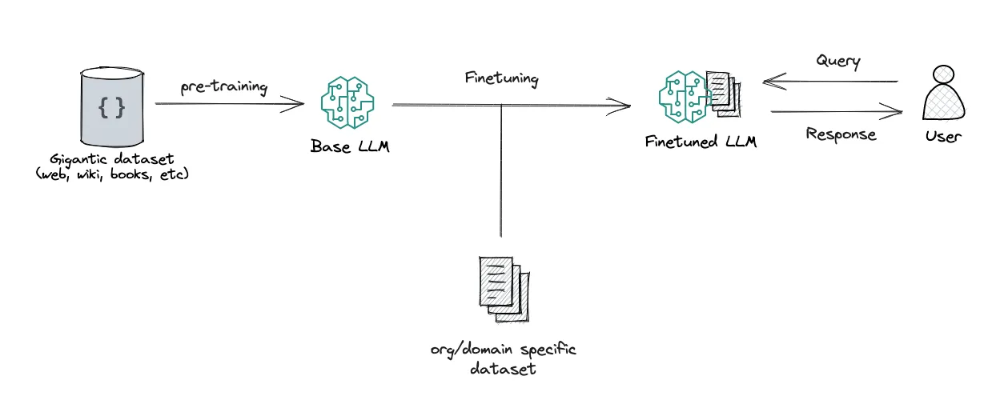

_图片来源：RAG vs Finetuning — Which Is the Best Tool to Boost Your LLM Application?_

## 多模态模型

多模态LLM将文本和其他模态的信息结合起来，比如图像、视频、音频和其他感官数据，多模态LLM接受了多种类型的数据训练，有助于transformer找到不同模态之间的关系，完成一些新的LLM不能完成的任务，比如图片描述，音乐解读，视频理解等。

_图片来源：ONELLM_

## Agent模型

LLM具备agent大脑的能力，与若干关键组件协作，包括，

规划（planning）：子目标拆解，纠错，反思和完善。

记忆（Memory）：短期记忆（上下文，长窗口），长期记忆（通过搜索或者向量引擎实现）

工具使用（tool use）：模型学习调用外部API获取额外的能力。

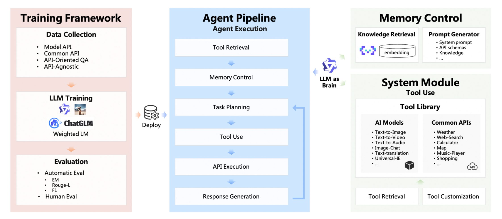

## Code模型

Code模型在模型的预训练和SFT中加入了更多的代码数据占比，在代码的一系列任务，比如代码补齐，代码纠错，以及零样本完成编程任务指令。同时，根据不同的代码语言，也会有python，java等更多的专业语言代码模型。

使用LLM及优化LLM输出效果

大语言模型是根据跨学科的海量的文本数据训练而成的，这也让大语言模型被大家认为最接近“AGI”的人工智能。然而，针对大语言模型，我们希望更好的使用LLM，让LLM更好的遵循我们的指令，按照我们可控的方式和特定行业的知识输出答案。如下的两种方式可以用来参考：

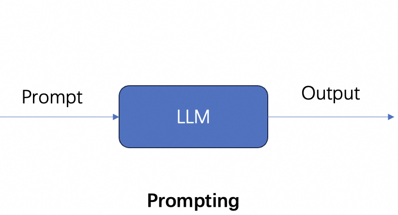

## 模型推理

模型推理指利用训练好的模型进行运算，利用输入的新数据来一次性获得正确结论的过程。

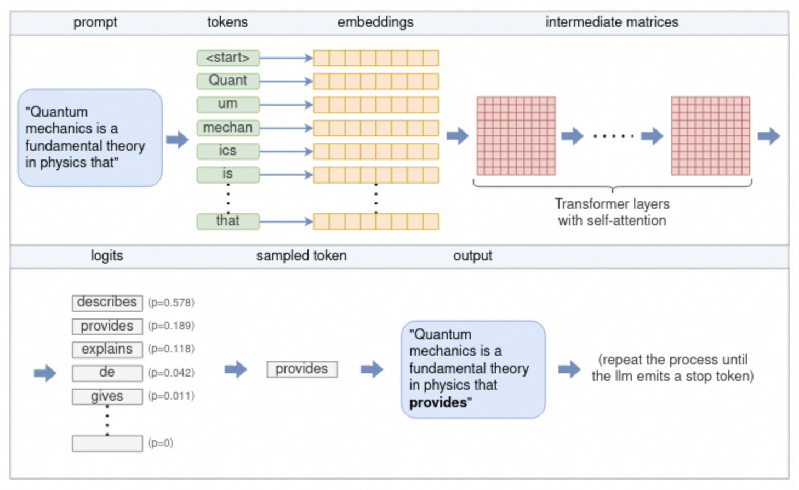

来源："understanding-how-llm-inference-works-with-llama-cpp"

参照图，流程如下：

1.  分_词器将提示拆分为标记_列表。根据模型的_词汇表_，某些单词可能会被拆分为多个标记。每个令牌都由一个唯一的数字表示。
    
2.  每个数字标记都会转换为embedding向量。embedding向量是固定大小的向量，以 LLM 更有效处理的方式表示标记。所有embedding一起形成embedding_矩阵_。
    
3.  嵌入矩阵用作_Transformer_的输入。Transformer 是一个神经网络，是LLM的核心。Transformer 由多层layer组成。每层都采用输入矩阵并使用模型参数对其执行各种数学运算，最值得注意的是self-attention机制。该层的输出用作下一层的输入。
    
4.  最终的神经网络将 Transformer 的输出转换为_logits_。每个可能的下一个标记都有一个相应的 logit，它表示该标记是句子“正确”延续的概率。
    
5.  _使用多种采样_技术之一从 logits 列表中选择下一个标记。
    
6.  所选token作为输出返回。要继续生成token，请将所选令牌附加到步骤 (1) 中的令牌列表，然后重复该过程。这可以继续下去，直到生成所需数量的token，或者 LLM 发出特殊的流结束 (EOS) 令牌。
    

## Prompt（提示词）

prompt（提示词）是我们和LLM互动最常用的方式，我们提供给LLM的Prompt作为模型的输入，比如“使用李白的口吻，写一首描述杭州的冬天的诗”，开源大模型引入了system消息和人工prompt的概念，可以根据提示提供更多的控制。

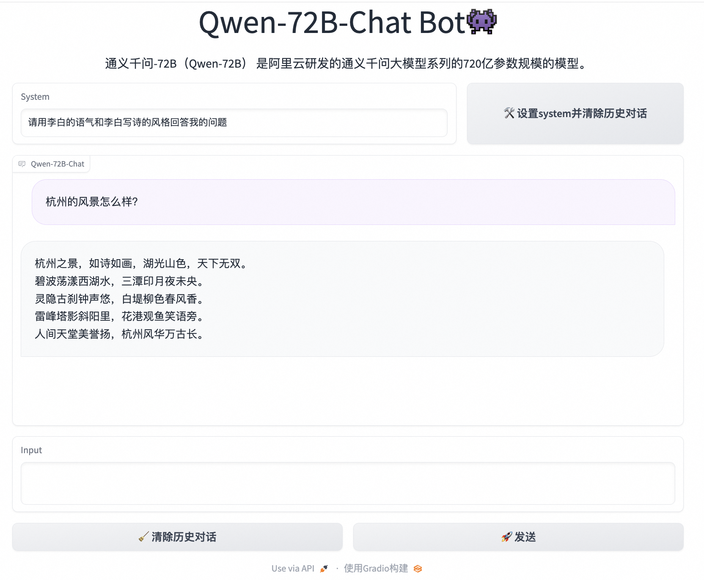

## few-shot prompt 

通过在prompt中增加一些输入和首选的优质输出的示例，可以增强LLM的回答效果，更好的遵循我们的指令。但是更多的示例，会收到LLM的上下文窗口的限制，更多的token也会增加算力的消耗，也会影响LLM的响应速度。

## LLM+RAG

大型语言模型 (LLM) 演示显着的能力，但面临诸如此类的挑战：幻觉、过时的知识以及不透明、无法追踪的推理过程。检索增强生成 (RAG)通过整合来自外部数据库的知识成为一个有前途的解决方案，这增强了模型的准确性和可信度，特别是对于知识密集型任务，并且允许知识的不断更新和整合特定领域的信息。 RAG协同作用将LLM的内在知识与广泛的、外部数据库的动态存储库。 

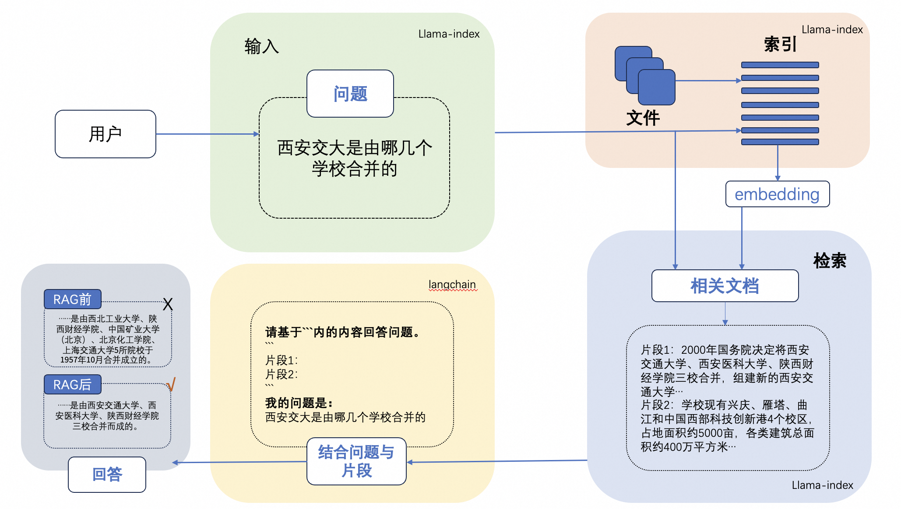

## 模型微调

微调是我们向开源的LLM的CKPT提供更多的数据，使他具备额外的知识，或者改变他的一些原来的生成结果。

微调会改变模型的权重，并可以更好的控制模型的生成结果。对比few-shot prompting的方式，也可以解决通过few-shot prompting方式带来的token消费高，模型响应速度慢，以及上下文窗口不够的问题。

微调也会产生一些意向不到的结果，并有可能导致模型的通用能力下降，所以需要客观的评估模型微调的结果。

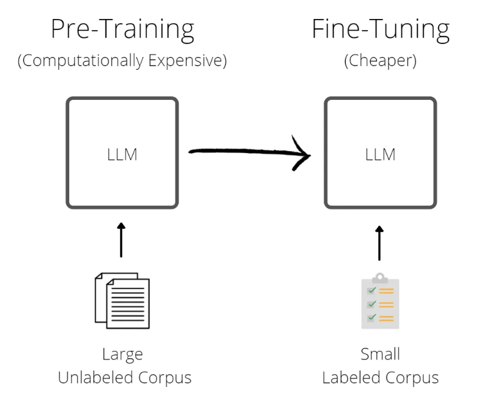

魔搭社区提供了一站式微调框架：SWIFT（Scalable lightWeight Infrastructure for Fine-Tuning）。它集成了各种高效的微调方法，如LoRA、QLoRA、阿里云自研的ResTuning-Bypass等，以及开箱即用的训练推理脚本，使开发者可以在单张商业级显卡上微调推理LLM模型。

## 模型量化

模型量化是使用低精度数据类型（例如 8 位整数 (int8)）而不是传统的 32 位浮点 (float32) 表示来表示模型中的权重、偏差和激活的过程。通过这样做，它可以明显减少推理过程中的内存占用和计算需求，从而能够在资源受限的设备上进行部署。模型量化在计算效率和模型精度之间取得微妙的平衡。目前主要使用的LLM开源量化工具主要有：bnb，GPTQ，AWQ

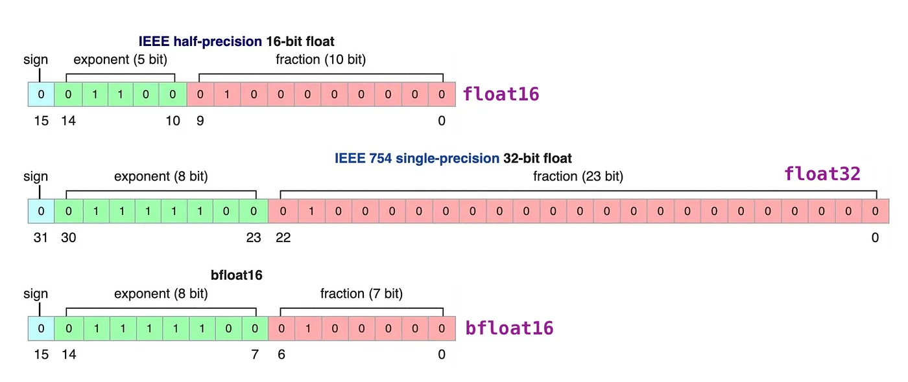

float32到float16的过程-来源：LLM Series - Quantization Overview

## 模型评估

LLM评估技术是研究和改进LLM的关键环节。LLM的评估是一项复杂的任务，需要考虑多个方面的评估维度和任务类型，如文本对话、文本生成、多模态场景、安全问题、专业技能（coding/math）、知识推理等。

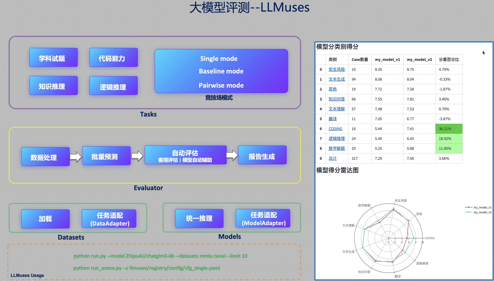

LLM评估通常可以人工评估和自动评估两大类。其中，自动评估（Automatic evaluation）技术又可以分为rule-based和model-based的方式。其中，rule-based主要面向客观题评价，评测题目通常包含标准答案；model-based方法主要用于评价主观题，如复杂知识推理、多轮会话、文本生成等，通过专家模型（Expert model）来评价目标LLM的生成效果。

魔搭社区提供了一套LLM评估框架--LLMuses，专注于使用自动评估方法来评估LLM在各个任务上的表现。其包含以下特性：

*   轻量化，易于定制
    
*   预置丰富的评估指标
    
*   Model-based模式，提供多种评价模式（Single mode、Pairwise-baseline、Pairwise-all）
    
*   可视化报告
    

## 模型推理加速和部署

魔搭社区的大语言模型LLM支持将模型托管在服务器或者云上，并创建API接口或者Web应用提供给用户与模型交互。

魔搭社区提供了针对不同开发者的模型部署方案：

1.  Swingdeploy：可以通过简单的选择0代码的方式，即可部署魔搭社区的模型到云上并生成供应用程序使用的API接口，支持弹性扩缩容和按需调用。
    
2.  阿里云PAI SDK：魔搭社区和阿里云PAI产品合作，支持通过PAI的python SDK在云上部署模型。
    
3.  vLLM推理加速：魔搭社区和vLLM合作，支持更快更高效的LLM推理服务，基于vLLM，开发者可以通过一行代码实现针对魔搭社区的大语言模型部署。
    
4.  多端异构部署：魔搭社区和Xinference合作，支持对LLM的GGUF和GGML各种部署，支持将模型部署到CPU甚至个人笔记本电脑上。
    
5.  分布式多模型部署：魔搭社区和fastchat合作，支持一行代码部署魔搭社区的大语言模型，支持Web UI和OpenAI兼容的RESTful API。
    

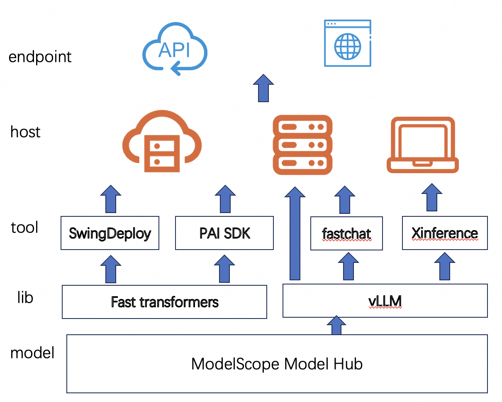

## 模型应用-agent

**Modelscope AgentFabric**是一个交互式智能体框架，用于方便地创建针对各种现实应用量身定制智能体。AgentFabric围绕可插拔和可定制的LLM构建，并增强了指令执行、额外知识检索和利用外部工具的能力。AgentFabric提供的交互界面包括：

*   **⚡ 智能体构建器**：一个自动指令和工具提供者，通过与用户聊天来定制用户的智能体
    
*   **⚡ 用户智能体**：一个为用户的实际应用定制的智能体，提供构建智能体或用户输入的指令、额外知识和工具
    
*   **⚡ 配置设置工具**：支持用户定制用户智能体的配置，并实时预览用户智能体的性能
    

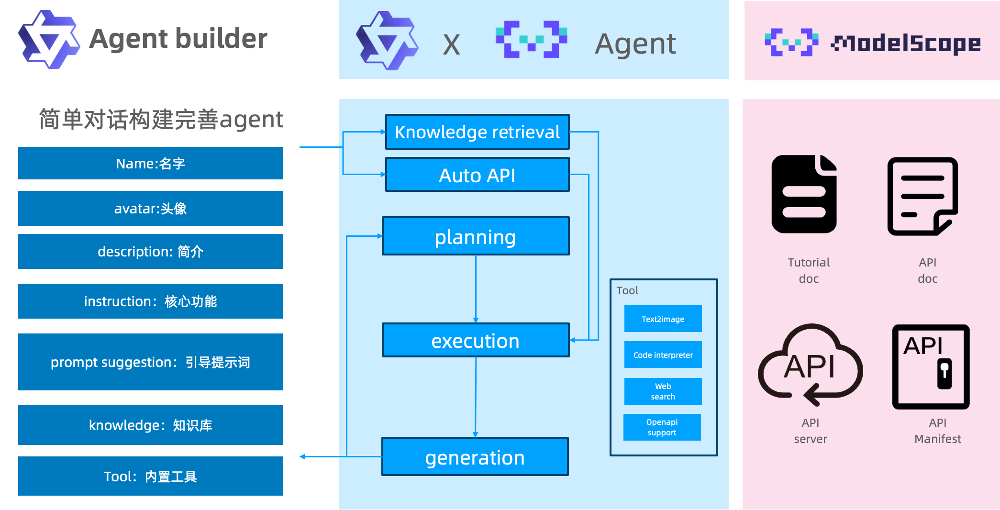

四、大作业设计

【大作业一：算法微调】

使用SWIFT框架（[https://github.com/modelscope/swift）对大模型(20B以下)进行微调](https://github.com/modelscope/swift）对大模型(20B以下)进行微调), 可选的任务有三个, 你只需要完成以下的一个任务即可。三个任务的难度依次递增, 我们会根据任务的难度和完成质量进行给分. 使用的模型和数据集任意选择。

题目

题目一：情感分类模型

要求:

1. 输入一段文本, 模型可以给出对应的情感分类. 该模型不需要支持多轮对话. 对应的情感分类的类别可以根据选择的数据集进行自行设计, 可以是二分类, 也可以是多分类.

题目二：代码助手模型

要求:

1. 给出一个询问, 例如: "使用python写快排.", 模型可以给出正确的示例代码(以及适当的代码注释). 需要支持一种或多种语言即可 (e.g. python, C, C++等).

2. 具有自我认知. 询问它是谁, 它的开发者是谁, 可以正确的进行回答.

3. 具有一定的多轮对话能力. (可选)

题目三：Agent模型微调

要求:

1. 可以调用以下API: 语音生成, 图像生成, python解析器. 如果可以调用更多的API, 可以酌情加分. 这些API接口可以在Modelscope创空间（[https://www.modelscope.cn/studios）中进行查找](https://www.modelscope.cn/studios）中进行查找), 并自己创建对应的微调数据集. (其中包含通用数据集混合来保持模型的通用能力). 模型可以在需用调用API的时候, 正确调用, 并生成对应的语音, 图像等内容; 不需要调用时, 可以正常回答. 需要保证系统的鲁棒性.

2. 具有自我认知. 询问它是谁, 它的开发者是谁, 可以正确的进行回答.

3. 具有一定的多轮对话能力. (可选)

提交要求

1. 提交训练的模型到ModelScope Hub.

2. 书写对应的模型README.md文件. 需包含模型的名字和简介, 实验环境, 训练方法 (使用的数据集, 微调的模型, 超参数, ...), 示例代码等内容. (示例代码需要实现对应任务要求的效果, 我们会对模型的效果进行测试), 该文件相当于实验报告.

【大作业二：Agent应用设计】

题目

使用ModelScope-Agent搭建一个Agent应用，发布在魔搭创空间，主题不限，最终根据作品的交互体验、创新创意、技术难度、作品展示分享4个维度进行评分。

评分维度

交互体验：作品可正常运行、并考察易用性、用户友好性、交互流畅性；

创新创意：从作品创意的原创性、市场潜力、成长空间、对行业/社会/特定领域的潜在影响力评分；

技术难度：作品对提示词工程（Prompt Engineering）和 大模型工具调用（Function Call）能力运用的灵活性和拓展性；如对ModelScope-Agent开源项目贡献可加分（如 自己通过代码实现工具接入、自己接入llm部分、对ModelScope-Agent提了issue 、提代码到ModelScope-Agent）、使用Multi Agent框架开发多Agent协作的应用作品可加分

作品展示：作品展示的质量，包括完整度、流畅度和吸引力

推荐工具

交互式搭建工具AgentBuilder：[https://www.modelscope.cn/studios/modelscope/AgentFabric/summary](https://www.modelscope.cn/studios/modelscope/AgentFabric/summary)

ModelScope-Agent Github：[https://github.com/modelscope/modelscope-agent](https://github.com/modelscope/modelscope-agent)

更多教程&示例：[https://www.modelscope.cn/brand/view/agent](https://www.modelscope.cn/brand/view/agent)